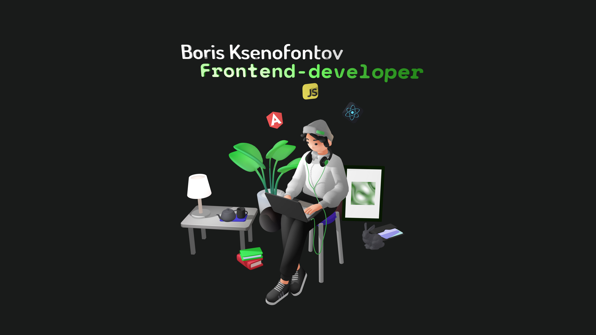

  

<h1 align="left">Привет👋 Меня зовут Борис!</h1>

Я Frontend-Developer👨🏻‍💻, с опытом работы 2 года🚀

*   ✉️  Связаться со мной: https://t.me/Vivektor
*   🧠  Учу RxJs

### Skills 

    
    
    
    
    
    
    
    
    
    

    

